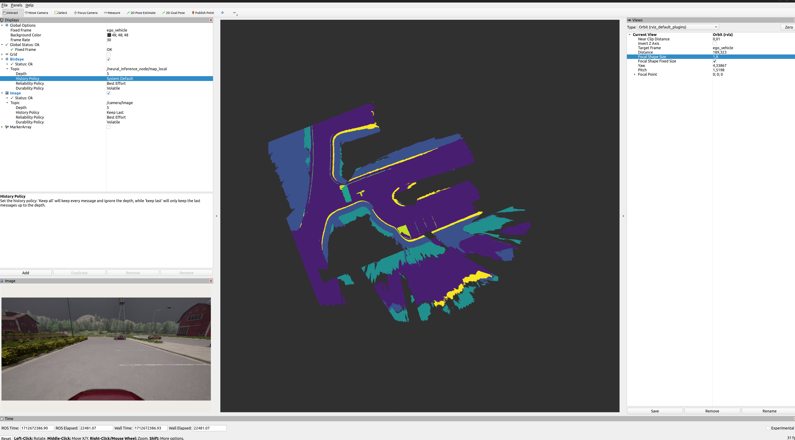

# RViz birdeye display

This package provides a plugin for RViz2 to visualize a "bird-eye" perspective CategoryGridMap topic in the 3d view. The plugin
requires a topic with type `drives_image_processing_msgs::msg::CategoryGridMap`.

